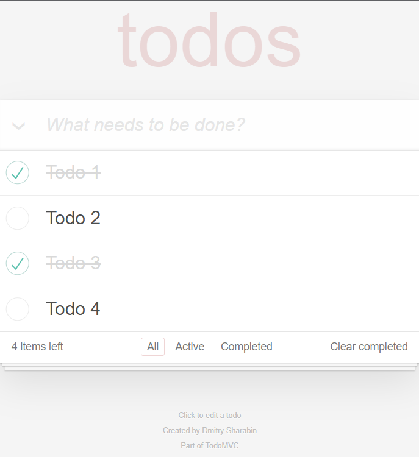

# `TODO App`
**Patika.dev** React Course TODO Application\
This project was bootstrapped with [Create React App](https://github.com/facebook/create-react-app)

## `Used Technologies`
- HTML
- CSS
- JavaScript
- TypeScript
- React
  - Context API

Run in project directory :
````shell
npm start
````
Runs the app in the development mode.\
Open [http://localhost:3000](http://localhost:3000) to view it in the browser.

